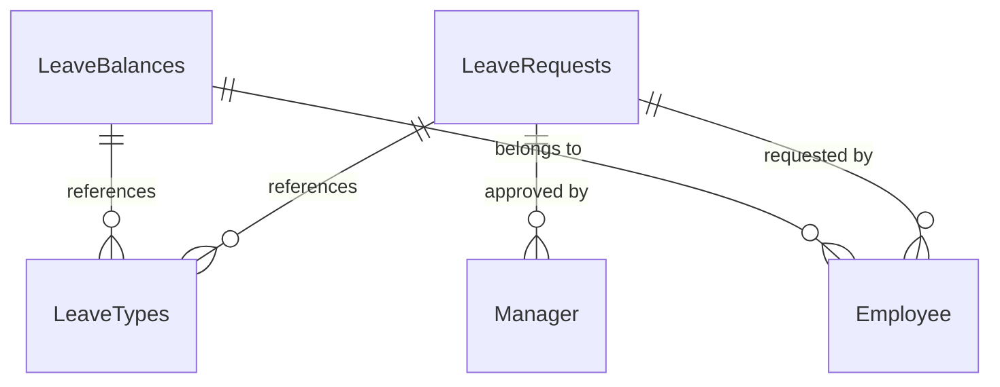

# SharePoint List Schemas for Vacation Request Solution

This document defines the SharePoint list schemas required for the Team Leave/Vacation Request and Calendar solution.

## 1. Leave Requests List

**List Name:** `LeaveRequests`
**Description:** Stores all leave/vacation requests submitted by employees

### Fields:

| Field Name | Type | Required | Description | Additional Settings |
|------------|------|----------|-------------|-------------------|
| ID | Counter | Yes | Primary Key | Auto-generated |
| Title | Single Line of Text | Yes | Auto-generated from template | Format: "{Employee} - {LeaveType} - {StartDate}" |
| Requester | Person or Group | Yes | Current user, indexed | Allow multiple selections: No |
| EmployeeID | Single Line of Text | No | From user profile | Max length: 50 |
| Department | Single Line of Text | No | From user profile | Max length: 100 |
| Manager | Person or Group | No | From user profile, indexed | Allow multiple selections: No |
| LeaveType | Lookup | Yes | References Leave Types List | Display field: Title |
| StartDate | Date and Time | Yes | Required, validated | Date only format |
| EndDate | Date and Time | Yes | Required, validated | Date only format |
| TotalDays | Number | No | Calculated field | Formula: =[EndDate]-[StartDate]+1 |
| IsPartialDay | Yes/No | No | Boolean flag | Default: No |
| PartialDayHours | Number | No | Conditional required | Min: 0.5, Max: 8, Decimals: 1 |
| RequestComments | Multiple Lines of Text | No | Optional | Rich text: No, Max length: 500 |
| ApprovalStatus | Choice | Yes | Workflow status | Choices: Pending, Approved, Rejected, Cancelled |
| ApprovalDate | Date and Time | No | Auto-populated | Date and time format |
| ApprovalComments | Multiple Lines of Text | No | From approver | Rich text: No, Max length: 500 |
| SubmissionDate | Date and Time | Yes | Auto-populated | Date and time format |
| LastModified | Date and Time | Yes | System managed | Auto-update |
| AttachmentURL | Hyperlink | No | Optional documentation | Display as: Hyperlink |
| WorkflowInstanceID | Single Line of Text | No | Power Automate tracking | Max length: 100 |
| NotificationsSent | Yes/No | No | Tracking flag | Default: No |
| CalendarEventID | Single Line of Text | No | Graph API integration | Max length: 100 |

### Views:

1. **All Requests** - Default view showing all requests
2. **My Requests** - Filtered by current user
3. **Pending Approvals** - For managers, filtered by ApprovalStatus = "Pending"
4. **Approved Requests** - Filtered by ApprovalStatus = "Approved"

## 2. Leave Types List

**List Name:** `LeaveTypes`
**Description:** Defines available leave types and their policies

### Fields:

| Field Name | Type | Required | Description | Additional Settings |
|------------|------|----------|-------------|-------------------|
| ID | Counter | Yes | Primary Key | Auto-generated |
| Title | Single Line of Text | Yes | Leave type name | Max length: 100 |
| Description | Multiple Lines of Text | No | Policy details | Rich text: Yes, Max length: 1000 |
| IsActive | Yes/No | Yes | Enable/disable types | Default: Yes |
| RequiresApproval | Yes/No | Yes | Workflow routing | Default: Yes |
| MaxDaysPerRequest | Number | No | Validation limit | Min: 1, Max: 365 |
| RequiresDocumentation | Yes/No | No | Attachment requirement | Default: No |
| ColorCode | Single Line of Text | No | Calendar display | Max length: 7, Format: #RRGGBB |
| PolicyURL | Hyperlink | No | Reference documentation | Display as: Hyperlink |
| CreatedDate | Date and Time | Yes | Audit trail | Auto-populate on creation |
| ModifiedDate | Date and Time | Yes | Audit trail | Auto-update |

### Default Data:

```json
[
  {
    "Title": "Annual Leave",
    "Description": "Standard annual vacation leave",
    "IsActive": true,
    "RequiresApproval": true,
    "MaxDaysPerRequest": 30,
    "RequiresDocumentation": false,
    "ColorCode": "#4CAF50"
  },
  {
    "Title": "Sick Leave",
    "Description": "Medical leave for illness",
    "IsActive": true,
    "RequiresApproval": false,
    "MaxDaysPerRequest": 5,
    "RequiresDocumentation": true,
    "ColorCode": "#FF9800"
  },
  {
    "Title": "Personal Leave",
    "Description": "Personal time off",
    "IsActive": true,
    "RequiresApproval": true,
    "MaxDaysPerRequest": 10,
    "RequiresDocumentation": false,
    "ColorCode": "#2196F3"
  },
  {
    "Title": "Maternity/Paternity Leave",
    "Description": "Family leave for new parents",
    "IsActive": true,
    "RequiresApproval": true,
    "MaxDaysPerRequest": 90,
    "RequiresDocumentation": true,
    "ColorCode": "#E91E63"
  },
  {
    "Title": "Emergency Leave",
    "Description": "Urgent personal matters",
    "IsActive": true,
    "RequiresApproval": false,
    "MaxDaysPerRequest": 3,
    "RequiresDocumentation": false,
    "ColorCode": "#F44336"
  }
]
```

## 3. Leave Balances List

**List Name:** `LeaveBalances`
**Description:** Tracks employee leave balances by type

### Fields:

| Field Name | Type | Required | Description | Additional Settings |
|------------|------|----------|-------------|-------------------|
| ID | Counter | Yes | Primary Key | Auto-generated |
| Employee | Person or Group | Yes | Indexed | Allow multiple selections: No |
| LeaveType | Lookup | Yes | References Leave Types List | Display field: Title |
| TotalAllowance | Number | Yes | Annual allocation | Min: 0, Max: 365, Decimals: 1 |
| UsedDays | Number | No | Calculated from requests | Min: 0, Decimals: 1 |
| RemainingDays | Number | No | Calculated field | Formula: =[TotalAllowance]-[UsedDays] |
| CarryOverDays | Number | No | From previous period | Min: 0, Max: 30, Decimals: 1 |
| EffectiveDate | Date and Time | Yes | Policy period start | Date only format |
| ExpirationDate | Date and Time | Yes | Balance expiry | Date only format |

### Views:

1. **All Balances** - Default view
2. **My Balances** - Filtered by current user
3. **Expiring Soon** - Balances expiring within 30 days

## List Relationships



## Permissions

### Leave Requests List:
- **Employees**: Create (own), Read (own), Edit (own, if status = Pending)
- **Managers**: Read (direct reports), Edit (ApprovalStatus, ApprovalComments)
- **HR**: Full Control
- **System Account**: Full Control (for workflows)

### Leave Types List:
- **Employees**: Read
- **Managers**: Read
- **HR**: Full Control
- **System Account**: Full Control

### Leave Balances List:
- **Employees**: Read (own)
- **Managers**: Read (direct reports)
- **HR**: Full Control
- **System Account**: Full Control

## Validation Rules

### Leave Requests:
1. EndDate must be >= StartDate
2. If IsPartialDay = Yes, then PartialDayHours is required
3. If LeaveType.RequiresDocumentation = Yes, then AttachmentURL is required
4. TotalDays cannot exceed LeaveType.MaxDaysPerRequest
5. Cannot request leave for past dates (except Emergency Leave)

### Leave Balances:
1. RemainingDays cannot be negative
2. UsedDays cannot exceed TotalAllowance + CarryOverDays
3. ExpirationDate must be > EffectiveDate

## Indexing Strategy

### Leave Requests:
- Requester (Person field)
- Manager (Person field)
- ApprovalStatus (Choice field)
- StartDate (Date field)
- LeaveType (Lookup field)

### Leave Balances:
- Employee (Person field)
- LeaveType (Lookup field)
- ExpirationDate (Date field)

## Backup and Archival

- Archive requests older than 2 years to separate list
- Maintain audit trail for all changes
- Daily backup of active data
- Quarterly full backup including archived data
